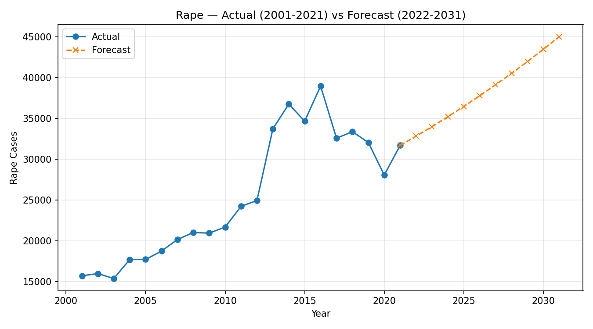
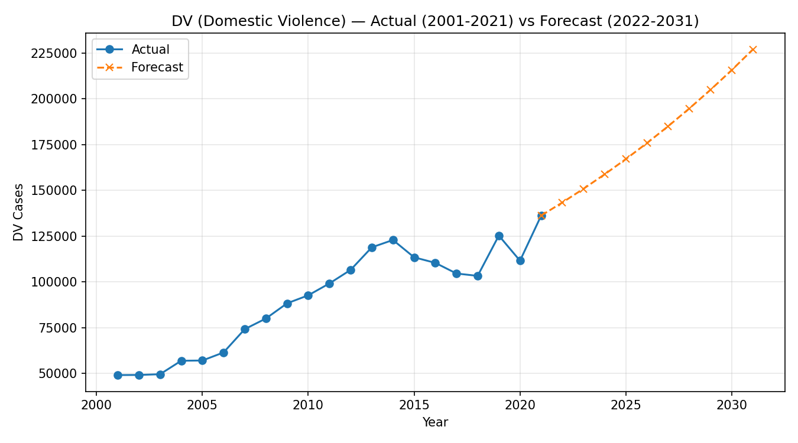
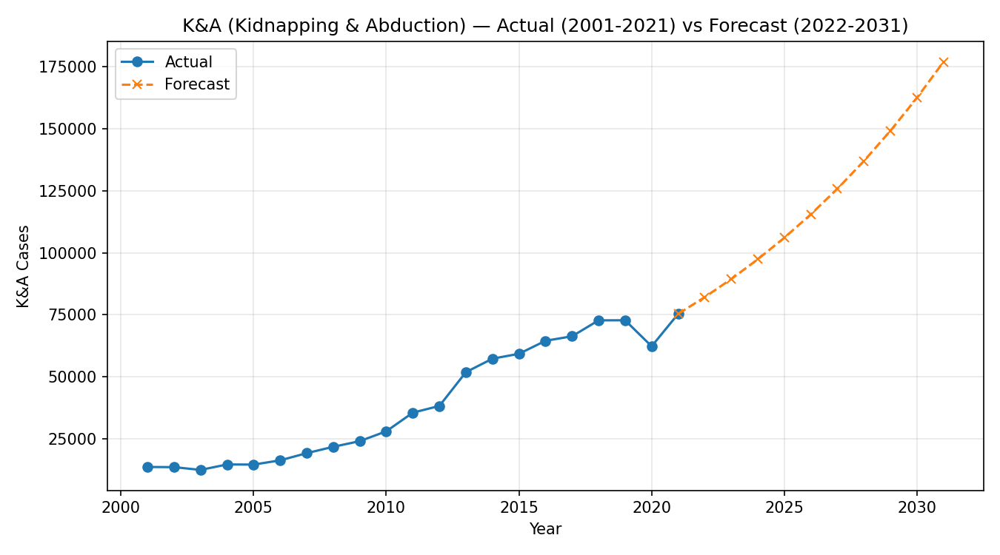
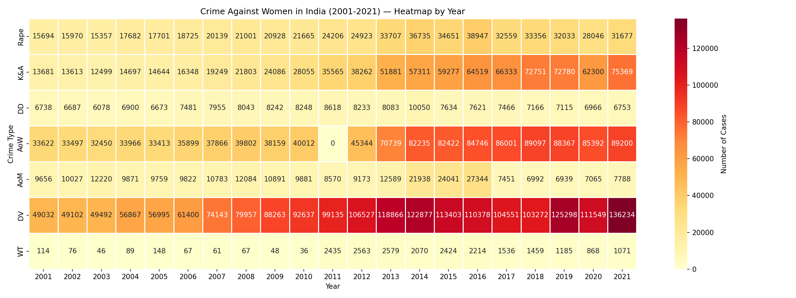
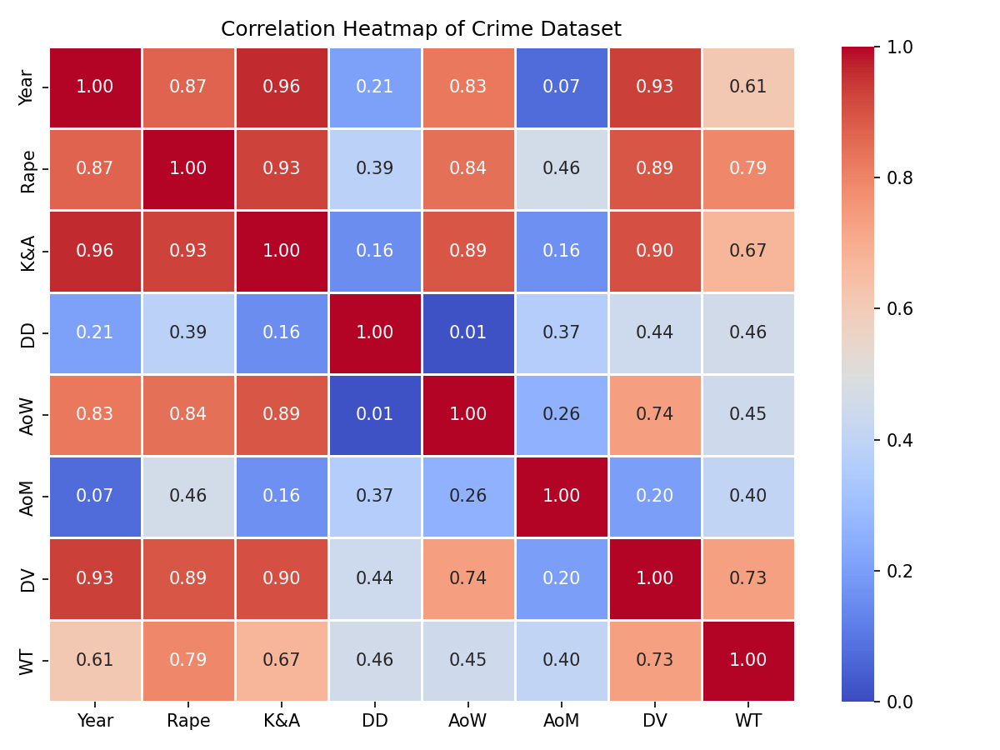
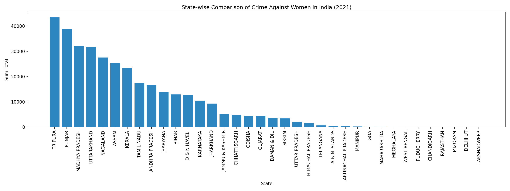

# Crime Against Women in India: A Statistical and Comparative Study

Statistical and time-series analysis of crimes against women in India (2001–2021), based on NCRB (National Crime Records Bureau) data. Originally submitted as an M.Sc. Statistics dissertation at the University of Lucknow (2025).

## Objective

- Analyze 20-year trends across major crime categories: Rape, Domestic Violence (DV), Kidnapping & Abduction (K&A), Dowry Deaths (DD), Assault on Women (AoW), Assault on Modesty (AoM), and Women Trafficking (WT)
- Test for statistical association between crime types across Indian zones/states
- Check normality of crime distributions using Shapiro-Wilk and Kolmogorov-Smirnov tests
- Forecast crime trends through 2031 using ARIMA/SARIMAX time-series models
- Compare state-wise crime burden between 2001 and 2021

## Tools & Methods

| Category | Tools/Techniques |
|---|---|
| Data cleaning & stats | SPSS |
| Time-series modeling | Python (statsmodels, pmdarima) — ARIMA, SARIMAX |
| Hypothesis testing | Pearson's Chi-Square Test, Shapiro-Wilk Test, Kolmogorov-Smirnov Test |
| Visualization | Python (seaborn, matplotlib) — heatmaps, forecast plots |
| Stationarity check | Augmented Dickey-Fuller (ADF) Test |

## Key Findings

- **Rape, Domestic Violence, and Kidnapping & Abduction** cases show a consistent upward trend from 2001–2021, with SARIMAX forecasts projecting continued growth through 2031.
- **Chi-square tests** (p < 0.001 across all four 5-year segments from 2001–2020) confirm a statistically significant association between crime types across India's zones — crimes don't occur in isolation; regions high in one category tend to be high in others.
- **Neither the 2001 nor 2021 state-wise crime distributions are normal** (Shapiro-Wilk test: 2001 → p < 0.00001; 2021 → p < 0.00001) — both are positively skewed, meaning a small number of states account for a disproportionate share of reported cases.
- **Uttar Pradesh, Rajasthan, West Bengal, and Madhya Pradesh** consistently report the highest crime volumes; Rajasthan overtook Uttar Pradesh's 2001 lead by 2021.
- **Correlation analysis** shows Rape and Assault on Women are strongly correlated (r = 0.80), as are Kidnapping & Abduction with both Rape (r = 0.70) and Domestic Violence (r = 0.69) — suggesting shared underlying socio-legal risk factors. Dowry Deaths and Workplace Trafficking show weaker correlations with other categories, pointing to distinct causal pathways.

## Repository Structure
├── report/
│   └── Crime_Against_Women_India_Thesis.pdf     # Full dissertation
├── data/
│   ├── crime_data_2001_2021.csv                 # NCRB-sourced yearly dataset
│   └── forecast_2001_2031.csv                   # Actual + SARIMAX-forecasted values
├── analysis/
│   ├── chi_square_association_test.py           # Zone-wise crime association test
│   ├── normality_tests.py                       # Shapiro-Wilk & K-S normality checks
│   ├── arima_sarimax_forecasting.py             # Time-series forecasting to 2031
│   ├── heatmap_analysis.py                      # Year-wise & correlation heatmaps
│   └── bar_chart_analysis.py                    # Period-wise & state-wise bar charts
├── visuals/
│   └── (forecast plots, heatmaps, bar charts, state comparisons)
└── requirements.txt

## Sample Result: Forecast Summary (2022–2031)

| Crime Type | Model | 2021 Actual | 2031 Forecast | Trend |
|---|---|---|---|---|
| Rape | ARIMA(0,1,0) | 31,677 | 45,004 | ↑ Rising |
| Domestic Violence | SARIMAX(0,1,0) | 136,234 | 227,084 | ↑ Rising |
| Kidnapping & Abduction | SARIMAX(0,1,0) | 75,369 | 176,897 | ↑ Rising |
| Dowry Deaths | SARIMAX(1,0,0) | 6,753 | 7,390 | → Stable/mild recovery |
| Assault on Modesty | SARIMAX(3,0,0) | 7,788 | 11,250 | ~ Fluctuating |

## Sample Visualizations

**Rape — Actual vs Forecast (2001–2031)**

**Domestic Violence — Actual vs Forecast (2001–2031)**

**Kidnapping & Abduction — Actual vs Forecast (2001–2031)**

**Crime Type by Year — Heatmap (2001–2021)**

**Correlation Between Crime Categories**

**State-wise Comparison — 2021**

*(See the `visuals/` folder for all 20 charts — forecast graphs, period-wise bar charts, state-wise comparisons, heatmaps, and normality histograms.)*

## Data Source

- National Crime Records Bureau (NCRB), Government of India — https://ncrb.gov.in
- Indian Penal Code, 1860 — Legislative Department, Ministry of Law and Justice

## Author

**Arti Singh** — M.Sc. Statistics, University of Lucknow
Supervised by Dr. Rohini Yadav, Associate Professor, Department of Statistics

---
*Full methodology, literature review, and legal analysis available in the [complete report](report/Crime_Against_Women_India_Thesis.pdf).*

